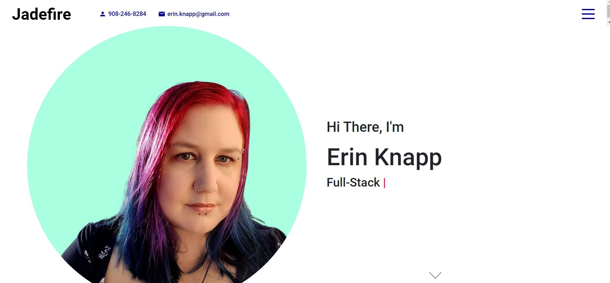

<h1 align="center"># React Portfolio - Erin Knapp</h1>

    
    
    
    

## Table of Contents
- [Description](#description)
- [Technology Used](#technology-used)
- [Images](#images)
- [Website URL](#website-url)

## Description

This is my developer portfolio using React. This portfolio is always a work in progress.

## Technology Used
* Javascript
* Sass
* React
* Boostrap
* NPM

## Images

## Website URL
https://erinknapp.github.io/react-portfolio-V2/